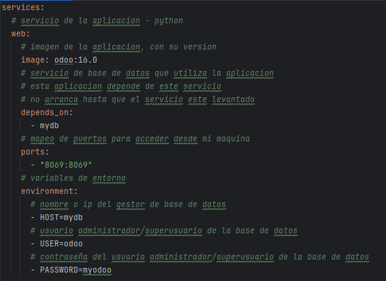
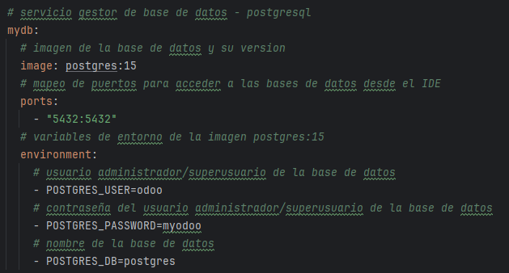
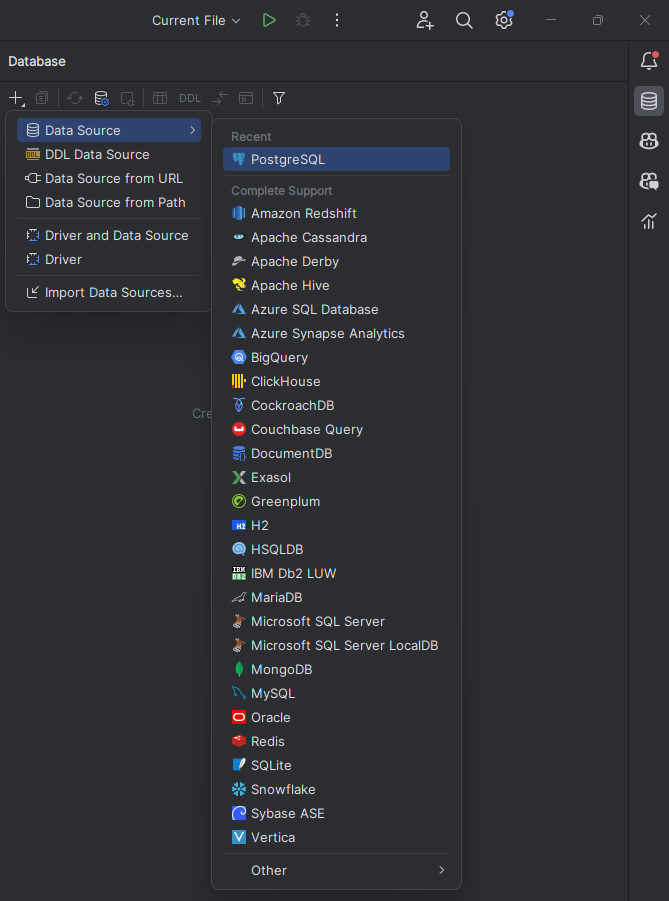
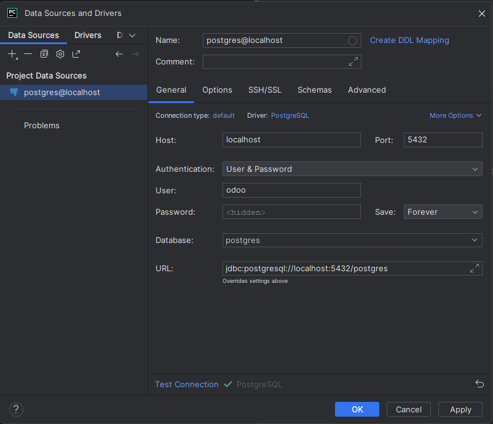
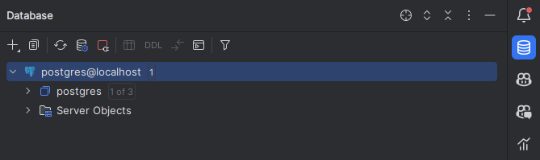
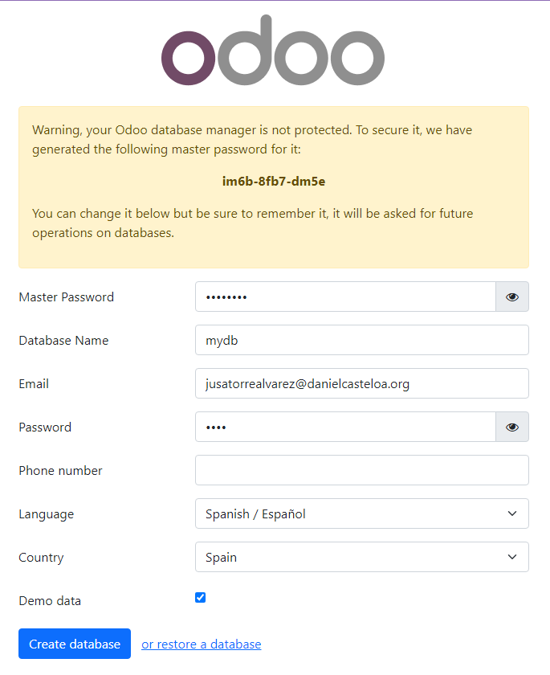
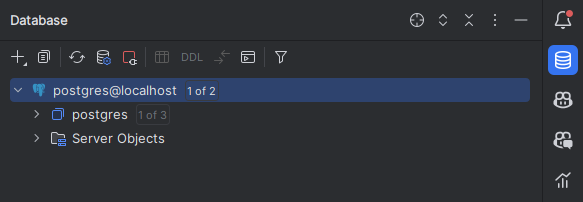

# Que es Odoo?
Odoo es una suite de aplicaciones de código abierto que cubre todas las necesidades de su empresa: CRM, comercio electrónico, contabilidad, inventario, punto de venta, gestión de proyectos, recursos humanos, etc. La aplicación es muy flexible y puede ser adaptada a las necesidades de su empresa. Odoo es una solución de software de gestión empresarial que incluye una amplia gama de aplicaciones empresariales.

### Que neceitamos para utilizar odoo:
- Tener instalado python
- Tener una base de datos creada en postgresql

## Docker compose:

### Odoo:



### Postgres:



En el apartado de postrges tenemos que tener cuidado con los puertos que utilizamos ya que si tenemos otro servicio que este utilizando el puerto 5432 no podremos utilizarlo.

### Para ejecutar el docker-compose.yml utilizamos el siguiente comando:


```bash
docker-compose up -d
```
## Funcionamiento de la base de datos desde nuestro IDE:

Para comprobar que la base de datos esta en correcto funcionamiento podemos desde nuestro IDE en mi caso Pycharm comprobar que la base de datos esta en funcionamiento:
+ Lo primero que tendremos que hacer es entrar en nuestra pestaña de bases de datos de nuestro IDE y crear una base de datos en Postgresql.



+ Una vez creada la base de datos nos aparecera una nueva pestaña emergente en la cual tendremos que rellenar diferentes campos como pueden ser el Usuario, la contraseña, el host, el puerto... en esta ventana una vez introduciomos todos los campos necesarios podemos hacer una comporbacion de la conexion para comprobar que todo esta en correcto funcionamiento.



+ Una vez creada la base de datos y comprobado que esta en correcto funcionamiento aparecera en la pestaña de bases de datos de nuestro IDE.


## Que ocurre si en nuestro ordenador el puerto 5432 esta ocupado? 

Si el puerto que estamos utilizando no esta disponible nos aparecera un error en el terminal el cual nos indicara que el puerto ya esta en uso, para sabeer quien lo esta utilizando utilizaremos el siguiente comnado:

```bash
sudo netestat -putan | grep 5432
```
En el caso de que nos se este utilizando este puerto podemos matar el proceso con el siguiente comando:

```bash
sudo kill nombre_del_proceso
```

## Comprobacion de que odoo esta en correcto funcionamiento:
Para comprobar que odoo esta en correcto funcionamiento tendremos que introducir en la url de nuestro navegador <localhost:8069> y nos aparecera la ventana de inicio de sesion de odoo.


### Comprobacion de que la nueva base de datos creada con odoo esta en funcionamiento:
Para comprobar que la base de datos esta en correcto funcionamiento debemos entrar denuevo en la pestaña de bases de datos y devemos refrescar, una vez refrescamos nos daremos cuenta de que a la derecha de la base de datos hay una nueva etiqueta de 1 of 2. 

